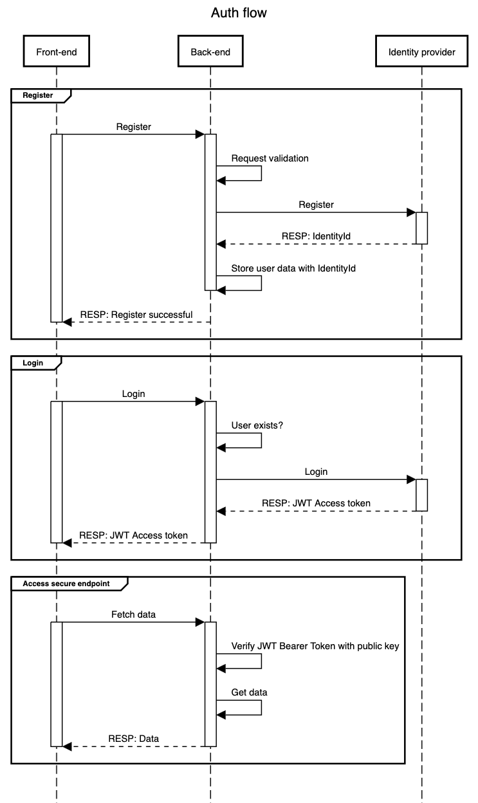

# Hobbyshop backend

Identity provider = Firebase (not Supabase, as Supabase is primarily positioned as a backend-as-a-service (BaaS) with built-in authentication, and its usual use case assumes the frontend (React) handles authentication directly.)
